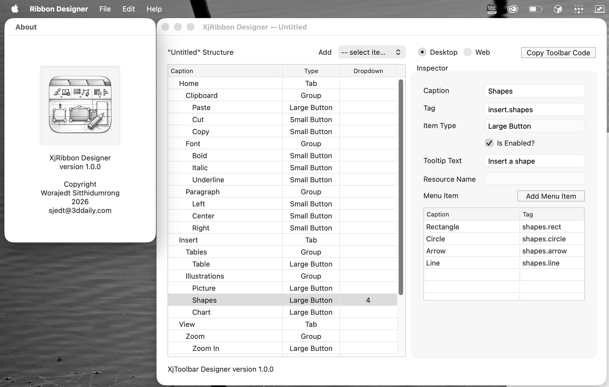

# XjRibbon

A Microsoft Office-style ribbon toolbar component for **Xojo 2025**, supporting both Desktop and Web platforms. Includes a standalone visual designer for building ribbon layouts and generating Xojo source code.


## Features

- **Tab-based navigation** with active/hover states
- **Three button types:** Large (icon + caption), Small (stacked columns of 3), Dropdown (with popup menu)
- **Contextual tabs** that show/hide by context (e.g., "Table Tools", "Picture Tools")
- **Collapse/Expand** via double-click or chevron toggle
- **Dark mode** support with automatic color adaptation
- **Icon support** with HiDPI-aware rendering and placeholder fallback
- **Per-item tooltips** and disabled states
- **Toggle buttons** with active highlight (Bold/Italic style)
- **Keyboard navigation** with KeyTip badges (Desktop only)
- **Visual Designer** for building ribbon structures and generating code



## Project Structure

```
XjRibbon/
├── desktop/          Desktop (DesktopCanvas) ribbon component
├── web/              Web (WebCanvas) ribbon component
├── designer/         Visual ribbon builder tool
├── LESSONS_LEARNED.md
└── LICENSE
```

## Desktop

The desktop implementation is a `DesktopCanvas` subclass with full rendering, layout, and event handling.

### Quick Start

Drop `XjRibbon` (canvas), `XjRibbonTab`, `XjRibbonGroup`, and `XjRibbonItem` into your project, then configure in the window's `Opening` event:

```vb
Var homeTab As XjRibbonTab = XjRibbon1.AddTab("Home")

Var clipGroup As XjRibbonGroup = homeTab.AddNewGroup("Clipboard")
Call clipGroup.AddLargeButton("Paste", "clipboard.paste")
Call clipGroup.AddSmallButton("Cut", "clipboard.cut")
Call clipGroup.AddSmallButton("Copy", "clipboard.copy")

Var fontGroup As XjRibbonGroup = homeTab.AddNewGroup("Font")
Var boldItem As XjRibbonItem = fontGroup.AddSmallButton("Bold", "font.bold")
boldItem.IsToggle = True
```

### Events

| Event | Description |
|-------|-------------|
| `ItemPressed(tag As String)` | Fired when a button is clicked |
| `DropdownMenuAction(itemTag, menuItemTag)` | Fired when a dropdown menu item is selected |
| `CollapseStateChanged(isCollapsed As Boolean)` | Fired when the ribbon collapses or expands |

### Contextual Tabs

```vb
Var tableTab As XjRibbonTab = XjRibbon1.AddContextualTab("Design", "Table Tools", Color.RGB(0, 128, 0))

' Show/hide by context
XjRibbon1.ShowContextualTabs("Table Tools")
XjRibbon1.HideContextualTabs("Table Tools")
```

### Keyboard Navigation (Desktop Only)

- **Ctrl+Option** (macOS) / **Alt** (Windows) or **F6** activates KeyTip mode
- Press the displayed letter to navigate to a tab or activate a button
- **Escape** backs out one level or dismisses KeyTips
- **Arrow keys** navigate between tabs or items

### Toggle Buttons

```vb
Var state As Boolean = XjRibbon1.GetToggleState("font.bold")
XjRibbon1.SetToggleState("font.bold", True)
```

## Web

The web implementation mirrors the desktop version using `WebCanvas`, with ~95% identical rendering and layout logic.

### Key Differences from Desktop

| Aspect | Desktop | Web |
|--------|---------|-----|
| Base class | `DesktopCanvas` | `WebCanvas` |
| Mouse tracking | Native events | JavaScript injection |
| Text measurement | `g.TextWidth()` | `Picture.Graphics` workaround |
| Transparency | `g.Transparency` | Color alpha channel |
| Scaling | 100% | 120% (optimized for web controls) |
| Dropdown menus | `DesktopMenuItem.PopUp` | Event-based |
| Keyboard nav | Full KeyTip support | Not implemented |

### Web Quick Start

Same API as desktop, configured in the page's `Shown` event:

```vb
Var homeTab As XjRibbonTab = XjRibbon1.AddTab("Home")
Var clipGroup As XjRibbonGroup = homeTab.AddNewGroup("Clipboard")
Call clipGroup.AddLargeButton("Paste", "clipboard.paste")
```

## Designer

A standalone Xojo Desktop application for visually building ribbon structures.

### Workflow

1. **Add** tabs, groups, and buttons via the toolbar popup menu
2. **Edit** properties in the inspector panel (Caption, Tag, Type, Tooltip, Menu Items)
3. **Reorder** items by dragging in the hierarchy list
4. **Save** as `.ribbon` JSON file for future editing
5. **Generate** Xojo source code and copy to clipboard

### Code Generation

The designer produces ready-to-paste Xojo code for either the `Opening` (Desktop) or `Shown` (Web) event. Variable names are auto-sanitized to valid Xojo identifiers with type suffixes.

### File Format

Ribbon definitions are saved as `.ribbon` JSON files:

```json
{
  "version": "1.0",
  "projectType": "desktop",
  "tabs": [
    {
      "caption": "Home",
      "groups": [
        {
          "caption": "Clipboard",
          "items": [
            {
              "caption": "Paste",
              "tag": "clipboard.paste",
              "itemType": "large",
              "isEnabled": true,
              "tooltipText": "Paste from clipboard"
            }
          ]
        }
      ]
    }
  ]
}
```

## Architecture

```
XjRibbon (Canvas subclass - controller + renderer)
 └── mTabs() As XjRibbonTab
      └── mGroups() As XjRibbonGroup
           └── mItems() As XjRibbonItem
```

- **XjRibbon** handles all rendering, layout computation, hit-testing, and event dispatch
- **XjRibbonTab** holds caption, groups, contextual properties, and KeyTip assignment
- **XjRibbonGroup** holds caption and items, with convenience methods for adding buttons
- **XjRibbonItem** holds caption, tag, type, icon, tooltip, toggle state, and menu items

Layout is computed in a single pass during `Paint`, storing bounds on each object for hit-testing.

## Color System

Colors adapt automatically based on `Color.IsDarkMode`:

- **Light mode:** White backgrounds, gray borders, dark text, blue accents
- **Dark mode:** Dark gray backgrounds (40-70 range), lighter borders, white text, blue accents

## Requirements

- Xojo 2025r3.1 or later
- macOS, Windows, or Linux (Desktop)
- Any modern browser (Web)

## License

MIT License - Copyright (c) 2026 Worajedt Sitthidumrong <sjedt@3ddaily.com>

See [LICENSE](LICENSE) for details.
